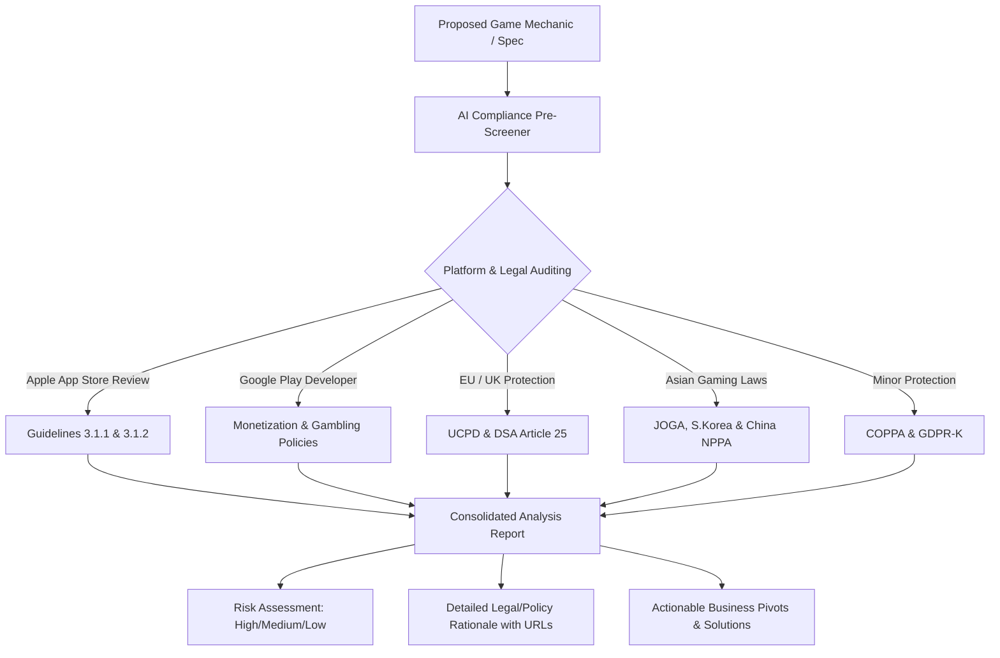

# ⚖️ Mobile Game Mechanic Compliance Pre-screener

[](https://opensource.org/licenses/MIT)
[](#)
[](#)
[](#)

> **Save your studio from devastating app store rejections, dark-pattern lawsuits, and global policy fines *before* writing a single line of code.**

---

## 🔍 Overview

The **Mobile Game Mechanic Compliance Pre-screener** is a professional-grade system prompt (AI Skill) designed specifically for Game Producers, Monetization Designers, and Product Managers. It transforms any advanced LLM into a **Strict Mobile Game Compliance Analyst** to audit proposed features, gacha systems, subscriptions, and live-ops events against global platform guidelines and consumer protection laws.



---

## ⚡ The Problem It Solves

Modern mobile game monetization is highly scrutinized. Releasing an update with a non-compliant monetization mechanic or a deceptive user flow can lead to:
*   ❌ **Devastating App Store Rejections** during critical live-ops campaigns.
*   📉 **Wasted Development Cycles** building features that must be completely redesigned.
*   ⚖️ **Multi-Million Dollar Fines** under EU/US consumer protection frameworks for "dark patterns."

This pre-screener provides an immediate, strict compliance audit with actionable pivots, ensuring your game mechanics remain highly profitable and legally sound.

---

## 📚 Supported Regulations & Policies

The pre-screener references a comprehensive library of policies and legal standards:

| Framework / Region | Covered Topics & Requirements | Key Reference Source |
| :--- | :--- | :--- |
| **Apple App Store** | Loot Box Odds (3.1.1), Subscription Transparency (3.1.2) | [App Store Guidelines](https://developer.apple.com/app-store/review/guidelines/) |
| **Google Play** | Subscription Billing, Deceptive Systems, Gambling Elements | [Play Developer Policies](https://play.google.com/about/developer-content-policy/policy-monetization-ads/) |
| **European Union** | Dark Patterns, False Urgency, DSA Article 25 Manipulations | [EU UCPD 2005/29/EC](https://eur-lex.europa.eu/legal-content/EN/TXT/?uri=celex%3A32005L0029) |
| **United Kingdom** | Subscription Auto-renewals & CMA Guidance | [EU DSA Article 25](https://eur-lex.europa.eu/legal-content/EN/TXT/?uri=CELEX%3A32022R2065) |
| **United States** | Minor protection, age gating, and data collection gates | [US COPPA Rule](https://www.ftc.gov/legal-library/browse/rules/childrens-online-privacy-protection-rule-coppa) |
| **Japan** | Complete Gacha (Comp Gacha) ban, gacha odds disclosures, caps | [JOGA Guidelines](https://japanonlinegame.org/guideline/) |
| **South Korea** | Mandatory public loot box drop rates & consumer deception | [Game Industry Promotion Act](https://elaw.klri.re.kr/eng_service/lawMain.do) |
| **China** | Anti-addiction, minor spending/time caps, real-name checks | [NPPA Gaming Rules](https://www.nppa.gov.cn/) |

---

## 🛠️ Setup & Installation

You can load this prompt into any advanced LLM. For best results, use models with strong reasoning capabilities (such as **Claude 3.5 Sonnet** or **GPT-4o**).

### Option 1: ChatGPT / Custom GPT
1. Navigate to **Explore GPTs** -> **Create**.
2. Go to the **Configure** tab.
3. In **Instructions**, copy and paste the entire contents of [`system_prompt.md`](./system_prompt.md).
4. Save as a private or organization-wide GPT named **"Game Mechanic Compliance Auditor"**.

### Option 2: Claude (Anthropic)
1. Start a new chat or open a **Project** in Claude.com.
2. If in a Project, paste the contents of [`system_prompt.md`](./system_prompt.md) into the **Project Instructions** or **System Prompt** settings.
3. Submit your design specs and mechanic write-ups for evaluation.

### Option 3: Local LLMs (Ollama / LibreChat)
1. Copy the system prompt contents from [`system_prompt.md`](./system_prompt.md).
2. Configure your System Instructions in LibreChat, Open-WebUI, or within your `Modelfile` for Ollama.
3. Set the temperature to a low setting (e.g., `0.2` - `0.3`) to ensure high factual accuracy and adherence to the reference links.

---

## 🚀 Quick Start / Try It Out

We have provided a highly realistic, complex monetization scenario inside [`test_case_input.md`](./test_case_input.md). You can use it to test the prompt's analysis.

### How to Test:
1. Load the [`system_prompt.md`](./system_prompt.md) into your chosen LLM as the system instruction.
2. Copy and paste the contents of [`test_case_input.md`](./test_case_input.md) into the chat.
3. Observe how the LLM systematically dissects:
   *   **Gacha transparency violations** (South Korea Game Industry Promotion Act / Apple Guideline 3.1.1).
   *   **Subscription cancellation dark patterns** (EU UCPD / Google Play Policy / Apple Guideline 3.1.2).
   *   **Aggressive FOMO mechanics** (EU DSA Article 25).
   *   **Minor-focused designs without age verification gates** (COPPA / GDPR-K / NPPA).

---

## 📄 License

This repository is licensed under the **MIT License**. Feel free to use, modify, and distribute it inside your game studio or as part of your open-source workflow.

```text
MIT License

Copyright (c) 2026

Permission is hereby granted, free of charge, to any person obtaining a copy
of this software and associated documentation files (the "Software"), to deal
in the Software without restriction, including without limitation the rights
to use, copy, modify, merge, publish, distribute, sublicense, and/or sell
copies of the Software, and to permit persons to whom the Software is
furnished to do so, subject to the following conditions:

The above copyright notice and this permission notice shall be included in all
copies or substantial portions of the Software.

THE SOFTWARE IS PROVIDED "AS IS", WITHOUT WARRANTY OF ANY KIND, EXPRESS OR
IMPLIED, INCLUDING BUT NOT LIMITED TO THE WARRANTIES OF MERCHANTABILITY,
FITNESS FOR A PARTICULAR PURPOSE AND NONINFRINGEMENT. IN NO EVENT SHALL THE
AUTHORS OR COPYRIGHT HOLDERS BE LIABLE FOR ANY CLAIM, DAMAGES OR OTHER
LIABILITY, WHETHER IN AN ACTION OF CONTRACT, TORT OR OTHERWISE, ARISING FROM,
OUT OF OR IN CONNECTION WITH THE SOFTWARE OR THE USE OR OTHER DEALINGS IN THE
SOFTWARE.
```
